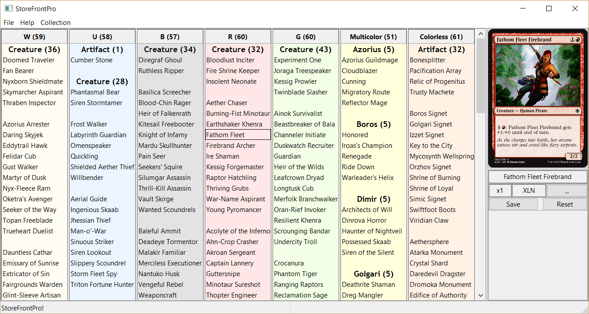
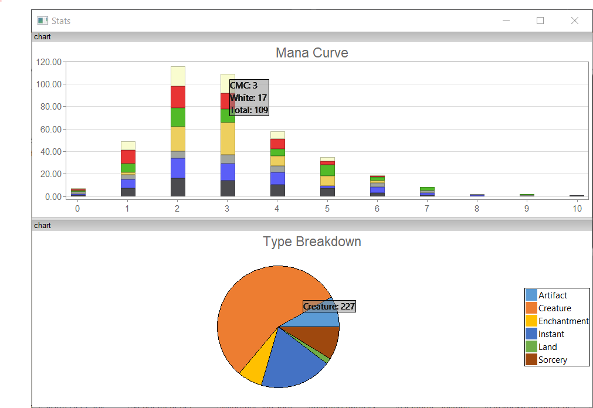
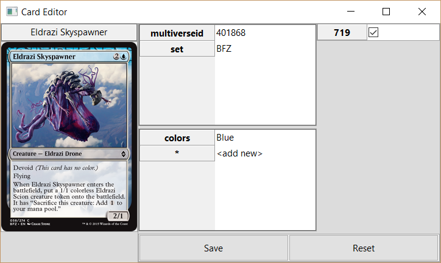

# Card-Collection-Manager
Program to manage cards. Built for Magic The Gathering (MtG) collection management. Build Decks, Track Cards and more.

Features
========
Stores card collections in a human readable format. Provides UI to sort/organize and add/remove cards from your collections. You can import collections in the simple format like below

	"My Deck"
	x3 Giant Growth
	Lightning Bolt
	x1 Giant Growth [5ED]
	
The list will be imported with the collection name `My Deck`. Each card in the list will be added with the number of copies specified, assuming 1 if not specified. You can specify the set
by include it in brackets `[SetCode]`, and that version of the card will be added to the set. Otherwise, a default copy will be added (any set).

Images
======

The UI is currently inspired by CubeTutor.

You can visualize collection statistics in the 'stats' view.

You can modify/override card traits in the traits editor. For example, you can sort 'colorless' cards by a custom color by adding the `colors` trait. Colors are `White`, `Blue`, `Black`, `Red`, `Green`.
Combinations of colors can be added too like so `Blue::Black`. This will work as long as the colors are in WUBRG order.

Dependencies
============
Currently the Collection manager only runs on windows as it relies on some Windows API calls.

	Installed dependencies:
	wxWidgets 3.1.1
	wxFreeChart https://github.com/MRobertEvers/Interactive-wxFreeChart
	
	Web API dependecies:
	MtGJSON (Card data)
	
	Header only (included in repo):
	nlohmann json https://github.com/nlohmann/json
	
	Included in Repo as static libs:
	zlib
	openSSL (for cURL)
	cURL

Build Instructions
==================
I don't have any build instructions 
outside of visual studio. I don't plan to build with other compilers.

You must have wxWidgets installed and the `WXWIN` defined in your environment variables as the wxWidgets installation directory. 
Additonally, you must have the custom `wxFreeCharts` build found at https://github.com/MRobertEvers/Interactive-wxFreeChart. That repository must be installed at 
`$(WXWIN)\wxFreeChart-master`.

The static link libraries for wxFreeChart must be built with unicode. For the debug build of the Collection Manager to succeed wxFreeChart must be built so that there is a wxFreeChart17u.lib (release), and a wxFreeChart17ud.lib (debug).
See the https://github.com/MRobertEvers/Interactive-wxFreeChart repository for build instructions (also only visual studio).

Build wxWidgets normally for `vc_mswu` and `vc_mswud`.

